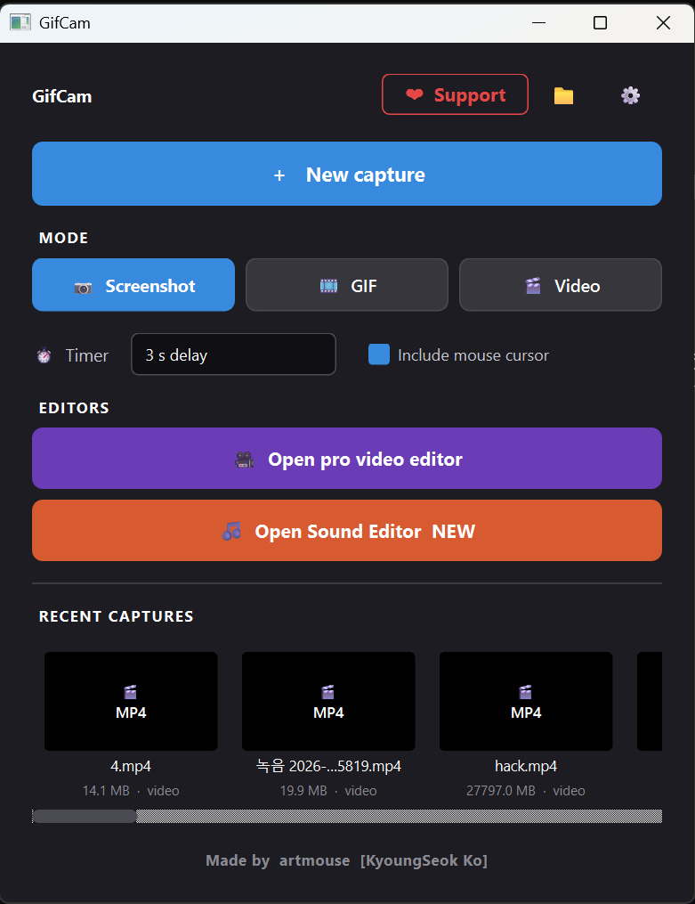
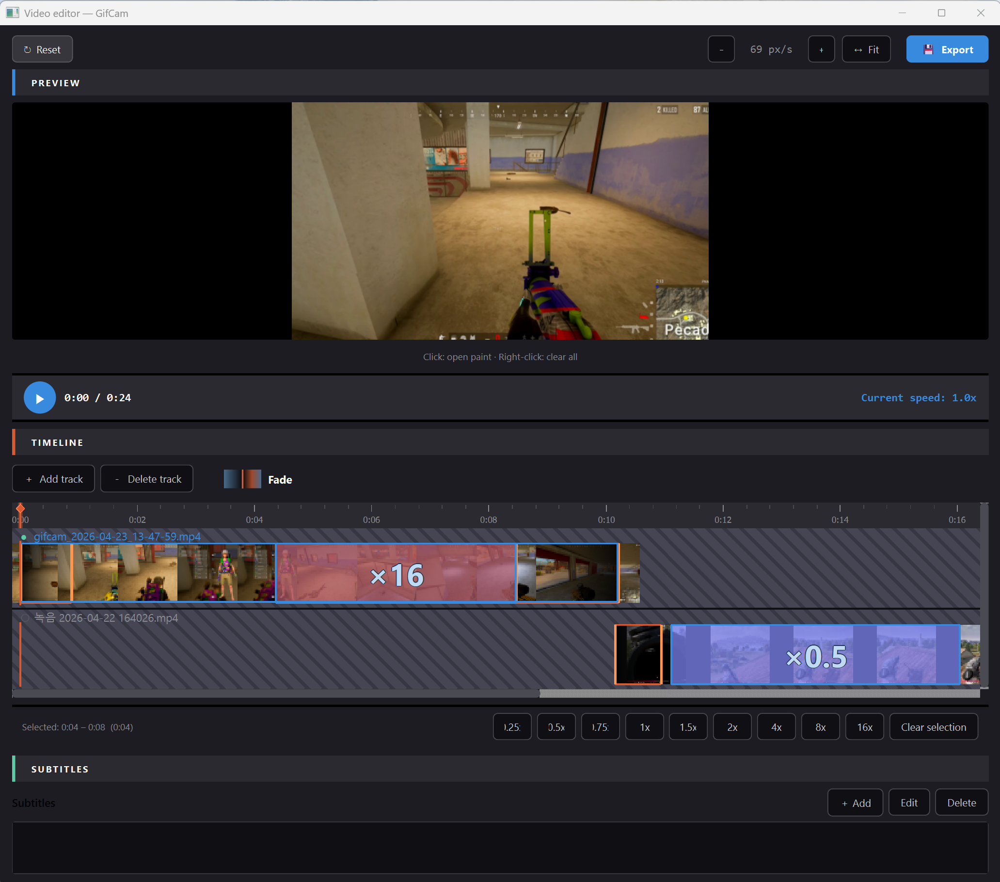
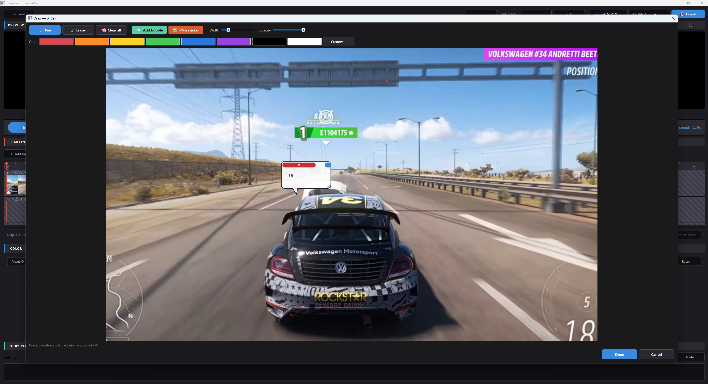
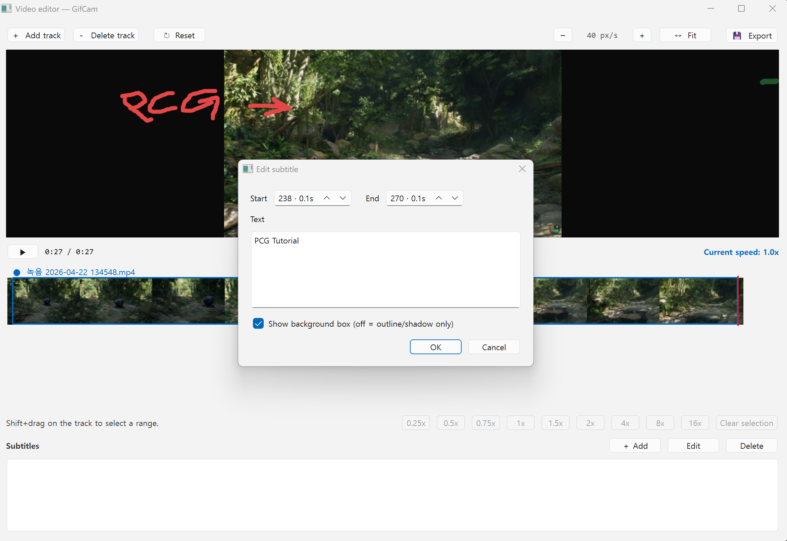

# GifCam

  <b>Screen capture for Windows — Screenshot · GIF · MP4 · Pro video editor</b>

  <a href="https://github.com/kuoungseok/gifcam/releases/latest">
    <b>▶ Download the latest installer</b>
  </a>

---

## Screenshots

### Main window

  

Win11 Snipping-Tool–style interface. Pick a mode (Screenshot / GIF / Video),
hit **New capture**, then drag to select a region. Recent captures are one
click away, and the **Pro video editor** shortcut lives right under the
capture options.

### Pro video editor

  

Multi-track timeline with live thumbnails, per-region speed from
**0.25× to 16×**, cut segments, playhead scrubbing, and one-click MP4
export. Drawings on the preview render live while you play (see below).

### 🖌 Paint on the preview  *(new in 1.2)*

  

Click the preview area in the Pro editor and a paint-style dialog opens
over the current frame. Pen, eraser, clear-all, **8-color palette + custom
picker**, width and opacity sliders. Strokes render on the preview while
you play back. Right-click the preview for a quick **Clear all**.

### Subtitles

  

Add time-aligned captions; toggle the background box on (semi-transparent
pill) or off (outline + drop shadow). Burned into the exported MP4.

---

## What makes GifCam different

### ⚡ Fast-motion and slow-motion in the **same** video
Select any range on the track and dial it from **0.25× up to 16× speed**.
Keep the rest at normal 1× — or layer multiple speed segments on top of
each other. A tutorial can zip through setup at 4× then settle into 1× for
the key steps, all in one clip.

### 🎞 Layered multi-track playback
Stack multiple clips. The top track plays by default; cut regions fall
through to the track beneath, and short tracks reveal the one under them
once they end. No timeline gaps.

### 🖌 Paint directly on the preview
Click the preview in the Pro editor to open a paint-style annotation
window. Pen, eraser, 8 preset colors + custom picker, width & opacity.
Strokes stay visible during playback — great for callouts and arrows.

### ⚙ Windows Graphics Capture backend
GPU-accelerated capture via the modern WGC API — 60 fps on large regions
without the black-frame and DPI quirks of GDI / BitBlt, even on mixed-DPI
multi-monitor setups.

### 📋 Subtitles with or without a box
Per-subtitle toggle. Show the classic semi-transparent box, or go box-free
with an outline + drop shadow. Burned into the exported MP4.

### 🖱 One-click "Quick paste"
Record, then press the **Quick paste** button — GifCam copies the file to
the clipboard, refocuses the window you were editing (Confluence, Jira,
Slack, Notion, KakaoTalk, Discord...), and sends `Ctrl+V` for you.

---

## Features at a glance

- **Screenshot / GIF / Video** modes with a Win11-Snipping-Tool–style UI
- **Multi-monitor, mixed-DPI aware** region selector
- **GIF encoder** with per-frame adaptive palette (+ automatic `gifski` /
  `gifsicle` if installed)
- **MP4 (H.264)** export with per-segment speed, cuts, and subtitle burn-in
- **Paint overlays** on the Pro editor preview
- **Multi-language UI** — 한국어 · English · 日本語 · Deutsch
  (auto-detected from Windows locale, live switchable)
- **Keyboard shortcuts** — `Ctrl+Shift+N` new capture, `Ctrl+1/2/3` mode
  switch, `Ctrl+O` save folder, `Ctrl+,` settings
- **Installer** that registers in *Settings → Apps* for a normal Windows
  uninstall experience

## Install

1. Download **`GifCam-Setup-1.2.0.exe`** from the
   [**Releases** page](https://github.com/kuoungseok/gifcam/releases/latest)
2. Double-click and follow the wizard — no admin rights required
3. Installed to `%LOCALAPPDATA%\GifCam`, listed in *Settings → Apps*

Captured files live in `~/Videos/GifCam` by default.

## System requirements

- Windows 10 1903+ or Windows 11
- x64

## Support the project

If GifCam saves you time, consider sending a few dollars:

- **PayPal** — https://paypal.me/KyoungseokKo
- **Toss Bank** (KRW transfer) — `1001-5567-2524` 고경석

## Author

**KyoungSeok Ko** ([artmouse](https://github.com/kuoungseok))

## License

[MIT](LICENSE)
